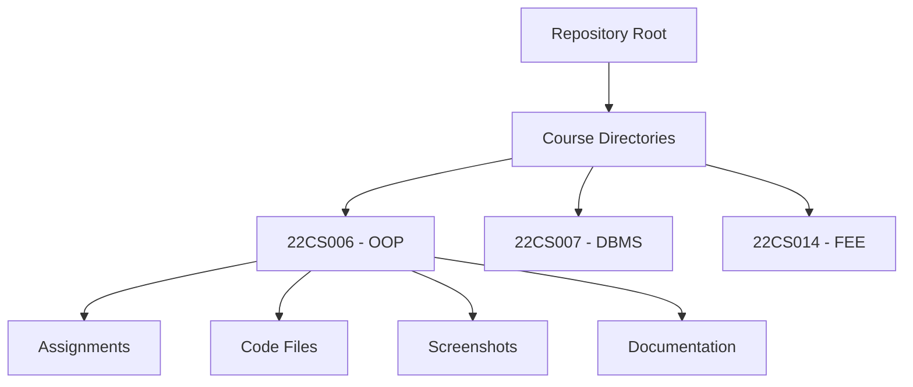

<div align="center">
  
# 🎓 University Course Solutions - TestPad


#### 🌟 A Comprehensive Collection of University Course Solutions and Implementations

[Explore Courses](#-courses) · [View Structure](#-repository-structure) · [Contribute](#-contributing) · [Get Started](#-getting-started)

</div>

---

## 📌 Table of Contents
- [Overview](#-overview)
- [Academic Integrity](#%EF%B8%8F-academic-integrity)
- [Courses](#-courses)
- [Repository Structure](#-repository-structure)
- [Getting Started](#-getting-started)
- [Contributing](#-contributing)
- [Directory Structure](#-directory-structure)
- [Best Practices](#-best-practices)
- [Support & Community](#-support--community)

## 📋 Overview
Welcome to the University Course Solutions repository! This carefully curated collection provides comprehensive solutions and implementations for various courses offered through TestPad. Whether you're studying Object-Oriented Programming, Database Management, or Front-End Engineering, this repository serves as your companion for better understanding and learning.

## ⚖️ Academic Integrity
> **Important Notice:** This repository is designed for educational purposes and conceptual understanding.

🚫 **What's Not Allowed:**
- Direct copying of solutions
- Submitting these solutions as your own work
- Sharing solutions during exams or assessments

✅ **How to Use This Repository:**
- Study the concepts and approaches
- Understand the problem-solving methodologies
- Practice implementing solutions independently
- Use as a reference after attempting problems yourself

## 📚 Courses
Currently featuring solutions for:

| Course Code | Course Name | Semester | Year |
|------------|-------------|-----------|------|
| 22CS006 | Object Oriented Programming in C++ | 3rd | 2023 |
| 22CS007 | Database Management System | 3rd | 2023 |
| 22CS014 | Front-End Engineering-II | 3rd | 2023 |

## 🗂 Repository Structure


### 📁 Organization
- **Course-Specific Directories**
  - Named with course code and title
  - Organized by topics and concepts
- **Content Structure**
  - 📝 Detailed assignments
  - 💻 Source code implementations
  - 📸 Visual references
  - 📄 Comprehensive documentation

## 🚀 Getting Started
1. **Clone the Repository**
   ```bash
   git clone https://github.com/anuj-er/Testpad-Solutions.git
   ```

2. **Explore Materials**
   - Browse topic-wise solutions
   - Study code implementations
   - Review documentation

## 🤝 Contributing
We welcome contributions! Here's how you can help:

1. **Fork the Repository**
2. **Create a Feature Branch**
   ```bash
   git checkout -b feature/AmazingFeature
   ```
3. **Commit Changes**
   ```bash
   git commit -m 'Add some AmazingFeature'
   ```
4. **Push to Branch**
   ```bash
   git push origin feature/AmazingFeature
   ```
5. **Open a Pull Request**

## 📂 Directory Structure
```
university-course-solutions/
│
├── 22CS006-Object-Oriented-Programming/
│   ├── Assignments/
│   ├── Code-Files/
│   ├── Screenshots/
│   └── Documentation/
│
├── 22CS007-Database-Management/
│   ├── DDL-Commands/
│   ├── Nested-Queries/
│   └── Practice-Sets/
│
└── 22CS014-Front-End-Engineering/
    ├── React-Components/
    ├── JavaScript-Basics/
    └── Project-Work/
```

## 💡 Best Practices
### For Students
1. **Active Learning**
   - ✏️ Take detailed notes
   - 🔄 Practice regularly
   - 🤔 Understand concepts deeply

2. **Problem Solving**
   - 📝 Attempt problems first
   - 🔍 Review solutions after
   - 🔄 Practice variations

### For Contributors
1. **Code Quality**
   - Follow style guidelines
   - Add comprehensive comments
   - Include test cases

2. **Documentation**
   - Write clear explanations
   - Add usage examples
   - Update relevant sections

## 🌟 Support & Community
- 💬 Open an issue for questions
- 🤝 Join our discussion forums
- 📢 Share your success stories

---

<div align="center">

### 💖 Made with Love for Students, by Students

*"The best way to predict the future is to create it." - Peter Drucker*

[](https://github.com/Anuj-er)

</div>

## 📜 License
This project is licensed under the MIT License - see the [LICENSE.md](LICENSE.md) file for details.

---

<div align="center">

**[⬆ back to top](#-testpad-solutions)**

</div>
